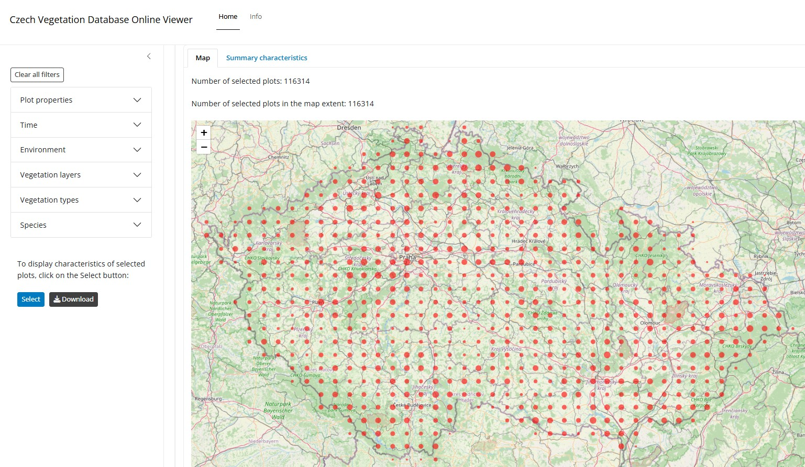

[https://vegscibrno.shinyapps.io/czechveg](https://vegscibrno.shinyapps.io/czechveg/)

This interactive viewer of the Czech Vegetation Database provides maps and summary characteristics of vegetation plots for the whole database and its subsets defined by plot size and location uncertainty, years of sampling, altitude, covers of vegetation layers, and occurrence of specific species or species groups.

