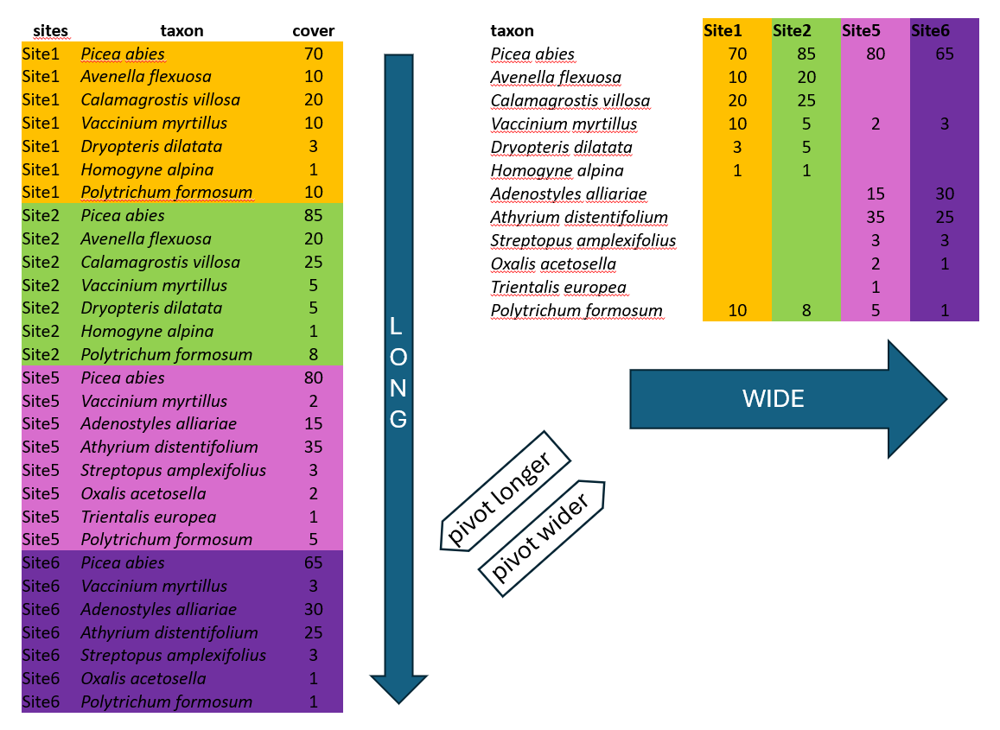
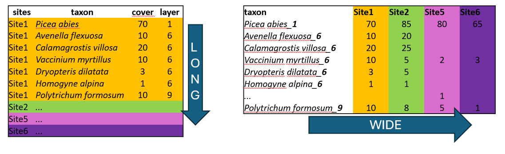
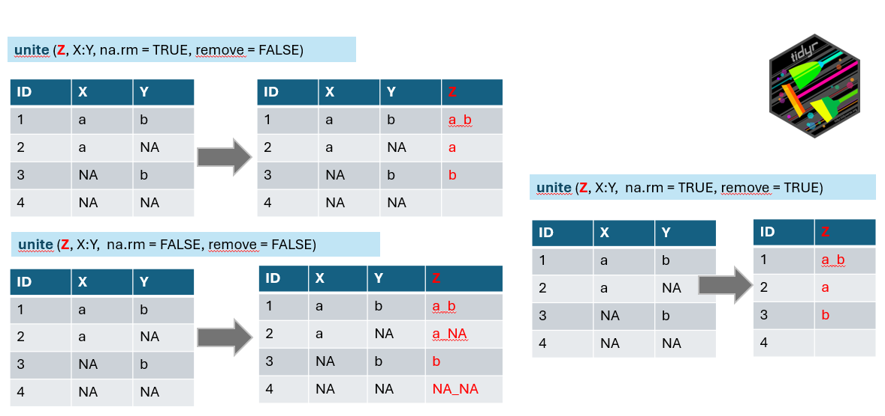
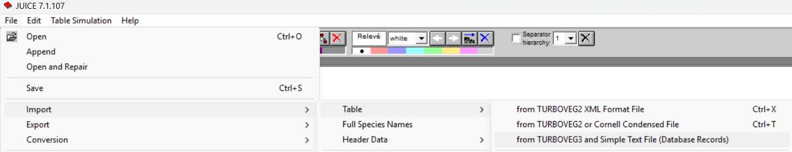
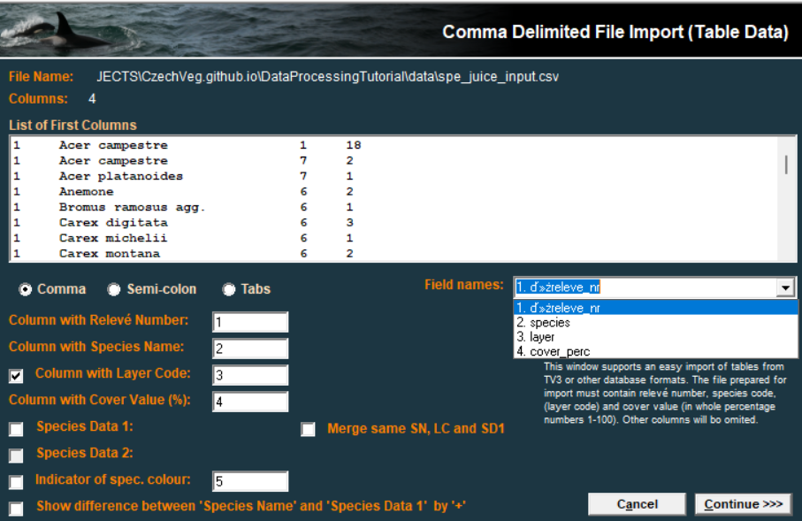

## 3.1 Long to wide format

There are two main ways how the data can be organised across rows and columns. Wide or long format. We will show you an example of spruce forest data, where we recorded plant species in several sites and at each site we also estimated their abundance, here approximated as percentage cover (higher value means that the species covered larger area of the surveyed vegetation plot, but we do not give the area itself, just value relatively to the total area, i.e. percentage of total area). The covers of species might overlap, as they grow in different heights.



**Wide format** is more conservative and used in many older packages for ecological data analysis. In our example we list all species and the colums are used to indicate their abundance at each site. This is the way you need to prepare your species matrix for ordinations in `vegan`. However, wide format has also many cons.

One of them is the size of the file. In the example above, there are abundance of given plants in each of the site. When the species is present in just one site, here *Trientalis europaea*, it is still keeping space across the whole table, where there can be hundreds or thousands of sites. The table code is then of course memory demanding. Another disadvantage is that you cannot add easily new information to the listed species. If you for example want to separate species that are in a tree vegetation layer (recognised in vegetation ecology as 1), herb layer (6) and moss layer (9), you would have to add this information to the name of the species e.g. *Picea_abies_1*.



**Long format** in contrast, is great for handling large datasets. We can also add any information, describing the data, such as vegetation layers, growth forms, native/alien status etc. After that we can very simply filter, summarise and calculate further statistics.

```{r}
#| warning: false 
library(tidyverse) 
library(readxl) 
library(janitor)
```

We will upload the species data saved in a long format and transform it into a matrix =wide format, so that it can be used in specific ecological analyses e.g. in `vegan`. (For wide to long see [study materials](https://botzooldataanalysis.github.io/DataManipulationVisualisation/4_wide_vs_long.html))

```{r}
spe <- read_csv("data/spe.csv") 
tibble(spe)
```

We can see that there are plant species names sorted by *releve_nr*, where each number indicates a vegetation record from one specific site (can be also called vegetation plot or sample). We may need to change the species names to be in the compact format, without any spaces, just underscores. For this we will use **mutate** function with **str_replace** (for string specification) indicating that each space should be changed to underscore and we will directly apply it to the original column.

```{r}
spe %>%    
  mutate(species = str_replace_all(species, " ", "_"))
```

We have the condensed name with underscores, but there are still more variables in the table. We can either remove them or merge them to be included in the final wide format. Here we will go a bit against tidy rules and add the information about the vegetation layer directly to the variable Species using **unite** function from the package `tidyr` which merges strings from two or more columns into a new one: **A+B =A_B**. Default separator is again underscore, unless you specify it differently by *sep=XX* argument.



Argument *na.rm* indicates what to do if in one of the combined columns there is no value but NA. We have set this argument to TRUE to remove the NA. If you keep it FALSE it can happen that in some data the new string will be a_NA or NA_b, or even NA_NA (see line 4 of our example).

*Remove* argument set to TRUE will remove the original columns which we used to combine the new one (in the example above you will have only z). In our case we will keep original columns for visual checking and we will use select function in the next step to remove them.

Note that function that works in an opposite direction is called `separate` or `separate_wider_delim`

```{r}
spe %>%   
  mutate(species = str_replace_all(species, " ", "_"))%>%   
  unite("species_layer", species,layer, na.rm = TRUE, remove = FALSE) 
```

At this point we have everything we need to use it as input for the wide format table: releve_nr. species_layer and values of the abundance saved as cover_perc. One more step is to select only these or to deselect (-) those not needed.

```{r}
spe %>%   
  mutate(species = str_replace_all(species, " ", "_"))%>%   
  unite("species_layer", species,layer, na.rm = TRUE, remove = FALSE)%>%
  select(releve_nr, species_layer, cover_perc)

```

Now we can finaly use the **pivot wider** function to transform the data. We have to specify from where we are taking the names of new variables (**names_from**) and from where we should take the values which should appear in the table (**values_from**). Since we changed the format, all species, even those not occurring in that particular site/plot have to get some values. Therefore, one more step is to fill the empty cells by zeros using **values_fill**. In this case we can do that, because we know that if the species was absent its abundance was exactly 0.

```{r}
spe %>%   
  mutate(species = str_replace_all(species, " ", "_"))%>%   
  unite("species_layer", species,layer, na.rm = TRUE, remove = FALSE)%>%
  pivot_wider(names_from = species_layer, 
              values_from = cover_perc, 
              values_fill = 0) -> spe_wide
```

```{r}
tibble(spe)
```

## 3.2 JUICE input files

JUICE can handle the species files in long format as well and it is called *database data import*. We can make a selection of the important fields (releve nr, species, layer and cover) and save the file as csv. However, JUICE is primarily working with integers. Therefore, the first step is to check the cover values we have in our dataset.

```{r}
spe %>% count(cover_perc)
```

Here we are using values of the new Braun-Blaunquet scale transformed to percentages with decimals. We can either use some crosswalk table (see the [table_cover](https://github.com/CzechVeg/CzechVeg.github.io/blob/main/Data/crosswalk_tables/table_cover.csv) and column COVER_PERC_EVA) or change the values directly in the script as below and save the output as a csv file. I recommend using the file with original covers and not the one after merging in R. The same approach as we did here for merging covers (see function in the last section of the [Turboveg to R](https://czechveg.github.io/DataProcessingTutorial/turboveg_r.html#merging-of-species-covers-across-layers)) can be done in JUICE later on and it saves you from rounding complicated values before export.

```{r}
spe %>% 
  select(releve_nr, species, layer, cover_perc) %>% 
  arrange(releve_nr) %>%
  mutate (cover_perc= case_when(cover_perc==0.1  ~ 1,
                                cover_perc==0.5  ~ 2,
                                cover_perc==3    ~ 3,
                                cover_perc==4    ~ 4,
                                cover_perc==10   ~ 8,
                                cover_perc==20   ~ 18,
                                cover_perc==37.5 ~ 38,
                                cover_perc==62.5 ~ 63,
                                cover_perc==87.5 ~ 88,
                                TRUE ~ cover_perc)) %>% 
  write_excel_csv("data/spe_juice_input.csv")
 
```

We will use the import through Database records. Note that sometimes it might be helpful to open the csv file in Excel and save it as csv UTF-8 again. The format seems to be the same but it respects your local settings of the environment.



Select the file and check if you have defined the positions of individual columns (1,2...) as it is in your file.



For headers we can use any selection of the header data, and import it as a second step.
