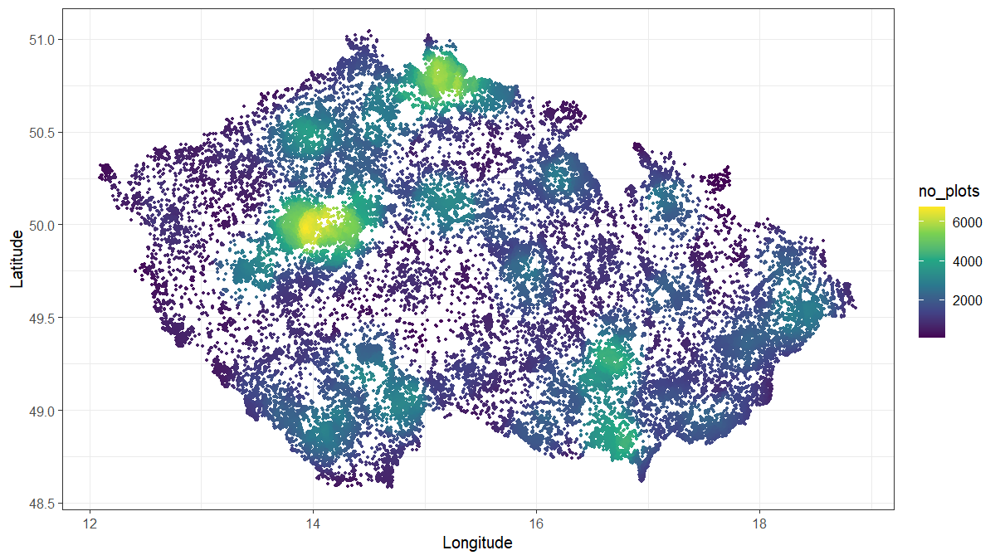
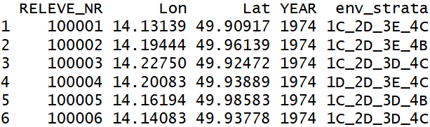
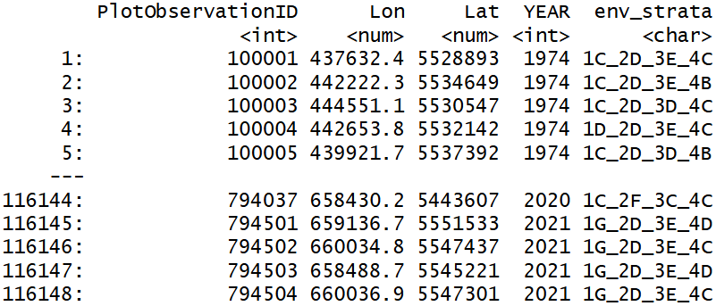
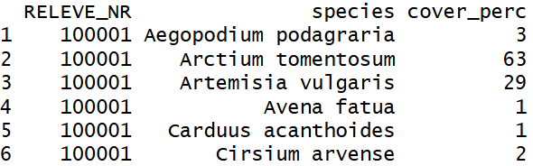
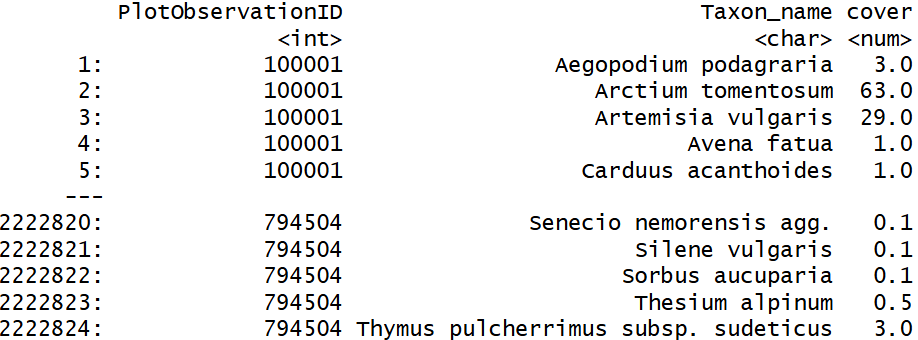
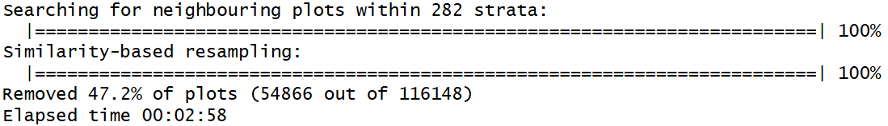
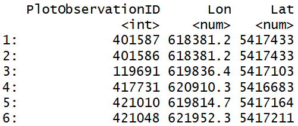
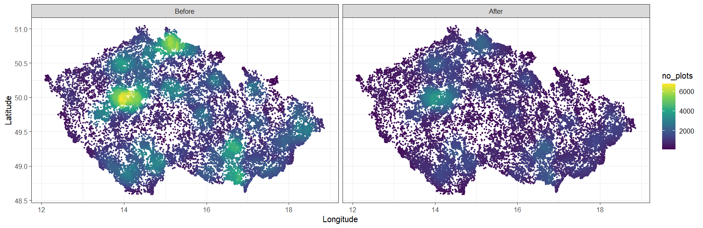

# Introduction

Vegetation-plot records from large databases, including CzechVeg, are usually unevenly distributed in space because some areas, such as nature reserves or other botanically attractive locations, have been sampled more frequently than others. Vegetation plots from these areas also often record the same vegetation type, leading to overrepresentation of this vegetation and its environmental conditions in the dataset. This may be undesirable in analyses that require evenly distributed data. To reduce local oversampling and provide a dataset that is spatially, environmentally, and compositionally more balanced, we have prepared a stratified version of the Czech Vegetation Database: [**CzechVeg-Open-Strat**](https://czechvegetationdatabase.github.io/Data/czech_veg_openstrat.html).

Now, we will go through all the steps of the resampling procedure so that every user of the CzechVeg data can prepare an alternative resampled and stratified dataset according to their own criteria. We will start with the CzechVeg-Open dataset. After removing plots without geographical coordinates and those containing only genera or non-vascular plants, the dataset contains 116,148 vegetation plots as shown below. Yellow areas are those with the highest plot density, which was calculated as the number of plots within the radius of 20 km from each plot.



For resampling, we will use the `resample` function developed specifically for vegetation-plot data. This function uses geographic proximity and species composition similarity of vegetation plots to reduce sampling density in areas where many plots are located close to each other and record compositionally similar vegetation. It is also possible to include environmental (or other) strata to perform the resampling within predefined environmentally similar groups of plots. The function first identifies the most similar pair of plots within the specified distance (and stratum, if used), removes one of them based on a selected rule, and repeats this process until no pairs that violate the specified distance and similarity thresholds remain in the dataset. A detailed technical description of the workflow is available [here](https://github.com/jdivisek/FilteringReleves).

First, let’s load required libraries.

```{r}
#| label: Load packages
#| eval: false
library(terra) #Transformation of coordinates
library(data.table) #Required by resample function
library(spdep) #Required by resample function
library(Matrix) #Required by resample function
library(vegan) #Required by resample function
library(igraph) #Required by resample function
```

# Data

To run stratified resampling of the CzechVeg-Open, we need two files:

**1) Header data with relevé ID, geographical coordinates and other optional variables**

The first object required by the `resample` function (`coord`) must be a `data.table` containing at least three columns including plot IDs and the longitude and latitude (or X and Y) coordinates of vegetation plots. Optionally, this `data.table` may include additional columns with environmental strata and a variable used to decide which vegetation plot will be removed from each pair of plots that are closer and more compositionally similar than specified thresholds. In our case, we will use 282 environmental strata defined based on principal component analysis (PCA) of 18 environmental factors (details can be found [here](https://czechvegetationdatabase.github.io/DataProcessingTutorial/data_stratification.html)). However, in the full CzechVeg-Open dataset we provide also alternative environmental stratifications of the country that are based on published literature and can be used as an alternative to our PCA-based strata. Finally, we will use also the year of sampling to prefer younger plots in the resampling procedure. This variable may contain `NA` values and the corresponding plots are removed first. So, let’s read the the header data and create `data.table`:

```{r}
#| label: Load data
#| eval: false
coord <- read.csv("header_data.csv", header = TRUE)
head(coord)
```

{width="425"}

As the first column with plot IDs must have a specific name, we need to rename it:

```{r}
#| label: Renaming
#| eval: false
colnames(coord)[1] <- "PlotObservationID"
```

Although the `resample` function can handle geographical coordinates in degrees (with `longlat = TRUE`) it is highly recommended to provide coordinates in meters. To achieve this, we need to project coordinates expressed in WGS 84 (EPSG: 4326) to metric WGS 84 / UTM zone 33N (EPSG: 32633) coordinate system. We will replace original coordinates in the `coord` object. The easiest way to is to use `terra::project()` function which can handle a matrix of coordinates and its thus not necessary to create a spatial object.

```{r}
#| label: Projecting coordinates
#| eval: false
coord[, 2:3] <- terra::project(as.matrix(coord[, 2:3]), from = "epsg:4326", to = "epsg:32633")
```

Note that for projecting coordinates of plots from other countries, appropriate projected coordinate system must be used.

And now, we can create a `data.table`:

```{r}
#| label: data.table
#| eval: false
coord <- data.table(coord)
coord
```

{width="543"}

**2) Species data in long format with relevé ID, taxon names and their covers**

The second object required by the `resample` function must be a `data.table` in long format containing relevé IDs, taxon names, and their percentage covers in each vegetation plot. All plot IDs must match those in the header data and vice versa. No `NA` values are allowed in any column.

```{r}
#| label: Reading species data
#| eval: false
spe <- read.csv("species_data.csv", header = TRUE)
head(spe)
```

{width="404"}

All columns must have specific names: `PlotObservationID`, `Taxon_name` and `cover`.

```{r}
#| label: Renaming columns
#| eval: false
colnames(spe) <- c("PlotObservationID", "Taxon_name", "cover")
```

And the object must be a `data.table`.

```{r}
#| label: spe to data.table
#| eval: false
spe <- data.table(spe)
spe
```

{width="626"}

# Resampling

Now, we are ready to run the resampling. First, let’t load the function:

```{r}
#| label: Load function
#| eval: false
source("https://raw.githubusercontent.com/jdivisek/FilteringReleves/refs/heads/main/ResampleFunction.R")
```

We will use the following criteria to remove the closest and most compositionally similar plots in each stratum:

-   `longlat = FALSE` This argument must be set to `FALSE`, because we use coordinates in the WGS 84 / UTM zone 33N coordinate system.

-   `dist.threshold = 1000` With this setting, the function will consider plots closer than 1,000 m as neighbors. Within this neighborhood, it will search for conflicting pairs that exceed the similarity threshold. Note that the value set depends on the coordinate system used. Please, see the detailed description [here](https://github.com/jdivisek/FilteringReleves).

-   `sim.threshold = 0.6` Pairs of neighboring plots with similarity exceeding this value will be resampled.

-   `sim.method = "simpson"` We use the Simpson similarity index, which is independent of differences in species richness, to calculate similarity in species composition.

-   `remove = "lower var.value"` This argument sets which plot from a conflicting pair will be removed. `"lower var.value"` removes the plot with the lower value in the column defined by the `var.value` parameter. `NA` values are allowed and these plots are removed first.

-   `var.value = "YEAR"` We use the year of sampling to remove the older plot from each conflicting pair. If both plots were recorded in the same year, a random plot will be removed.

-   `strata = "env_strata"` This argument specifies the column in `coord` that contains environmental stratification. Plots will be resampled separately within each stratum.

-   `seed = 1234` The seed value for the random number generator, which ensures reproducibility of results.

After setting this criteria, we can run resampling:

```{r}
#| label: Run resampling
#| eval: false
res <- resample(coord = coord,
                spec = spe, 
                longlat = FALSE, 
                dist.threshold = 1000, 
                sim.threshold = 0.6,
                sim.method = "simpson",
                remove = "lower var.value",
                var.value = "YEAR", 
                strata = "env_strata", 
                seed = 1234)
```

{width="682"}

On a laptop with 32 GB RAM and an Intel Core i7-11850H 2.5 GHz processor, resampling 116,148 plots took less than 3 minutes. As a result, we obtained a `data.table` with PlotObservationIDs and coordinates for **61,282 plots** that are either more than 1,000 m apart or less similar than 0.6 within each environmental stratum.

```{r}
#| label: Show result
#| eval: false
res
```

{width="379"}

As shown below, the density of plots in intensively sampled areas decreased considerably. This dataset is provided as [**CzechVeg-Open-Strat**](https://czechvegetationdatabase.github.io/Data/czech_veg_openstrat.html).


