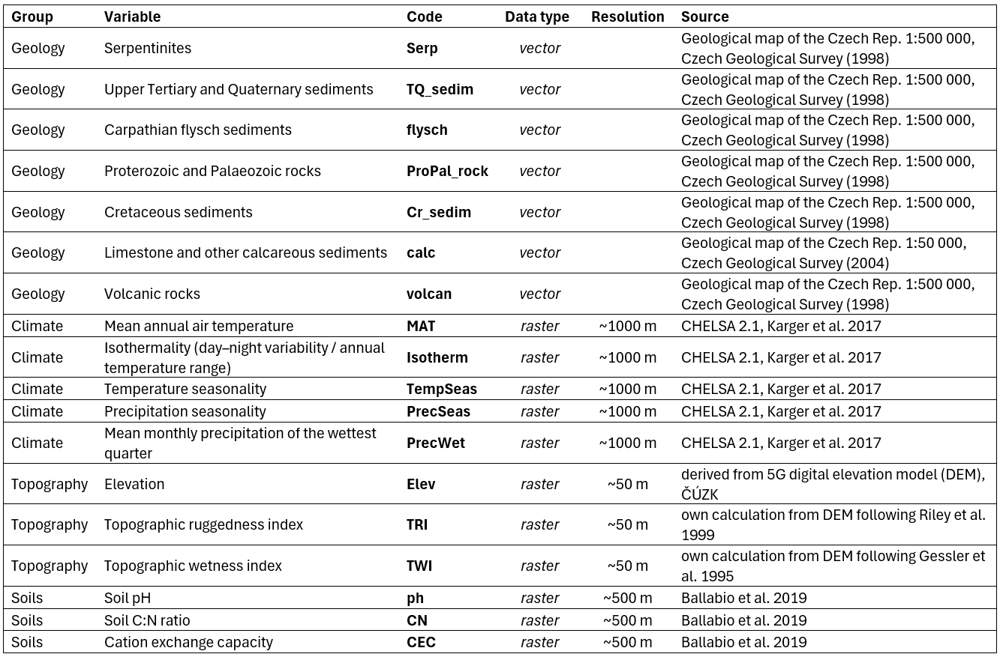
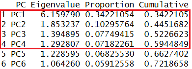
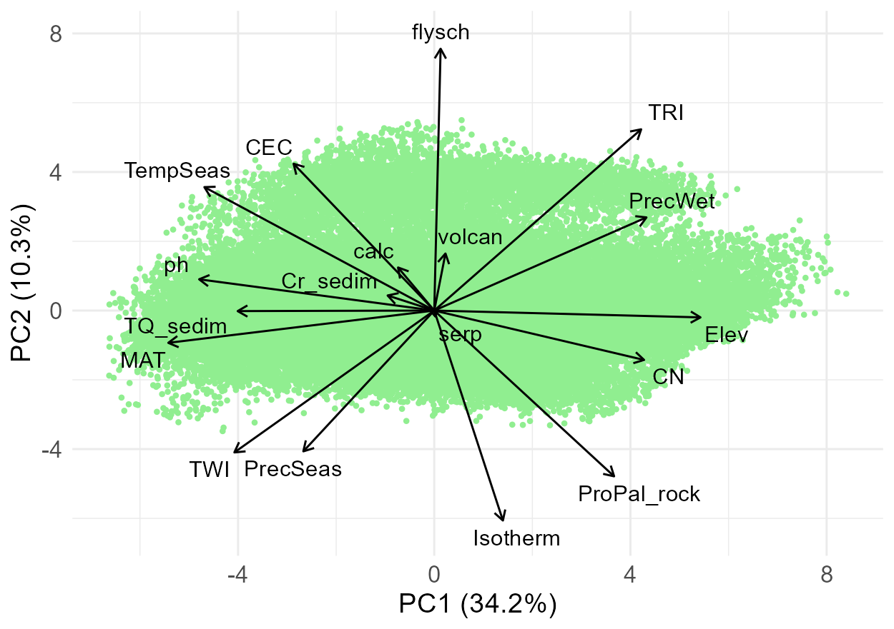
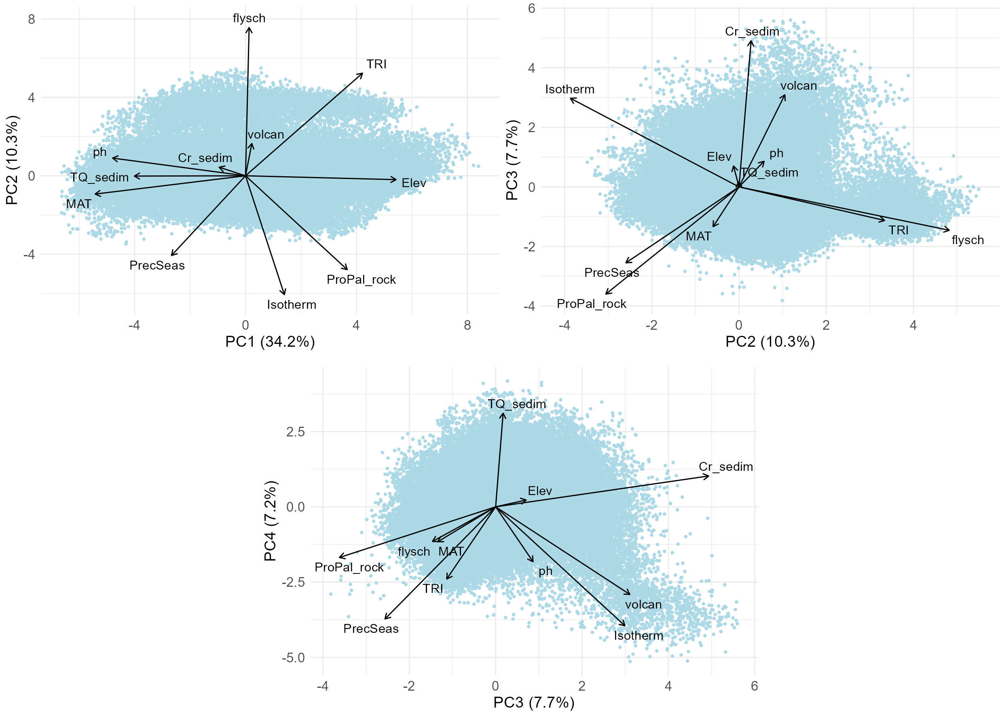
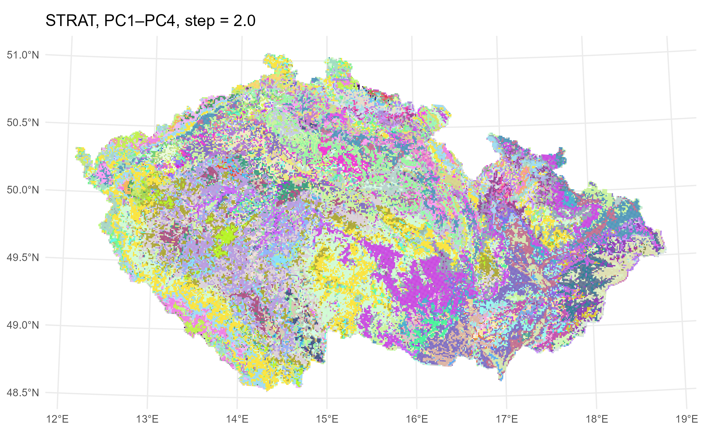
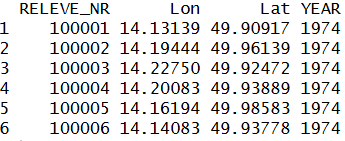

# Introduction

We followed the procedure below to create an environmental stratification scheme for [CzechVeg-OpenStrat](https://czechveg.github.io/Data/czech_veg_openstrat.html), the environmentally stratified version of the Czech Vegetation Database.

As spatial units for the environmental strata, we used the [1 km EEA reference grid for the Czech Republic](https://sdi.eea.europa.eu/catalogue/srv/api/records/9e80fdac-a518-462b-942b-82701035c079f). Each 1 km grid cell was assigned to a stratum based on a combination of environmental variables using principal component analysis (PCA). We then assigned each vegetation plot (N = 116,148) to a stratum based on the grid cell in which it was located. This assignment was subsequently used as one of the criteria in the resampling procedure (described [here](https://czechveg.github.io/DataProcessingTutorial/data_resampling.html)) to prepare a spatially and environmentally balanced, publicly available subset of the Czech Vegetation Database.

```{r}
#| label: Load packages
#| eval: false
## required packages
library(sf)         # handling vector GIS layers  
library(terra)      # spatial data analysis
library(dplyr)      # data manipulation
library(tidyr)      # data reshaping
library(ggplot2)    # plots
library(ggrepel)    # avoiding overlaps of labels in ordination plots
library(randomcoloR)# random colours generator 

## read 1 km grid
cz.grid <- st_read("input_env_data/cz_1km_sstricto.shp") # coordinate system: ETRS89-extended / LAEA Europe

## reproject coordinate system, check https://epsg.io/
cz.grid.wgs <- st_transform(cz.grid, 4326)  # WGS 84, for calculation
cz.grid.utm <- st_transform(cz.grid, 32633) # WGS 84 / UTM zone 33N, for visualization
```

# Data preparation

For the PCA we used 18 variables relating to geology, climate, topography, and soils.



These variables were selected based on a preliminary PCA of climate variables, correlation analysis (omitting highly correlated variables), and expert knowledge. Soil rasters from LUCAS contained NoData pixels in some areas across the Czech Republic (typically urban agglomerations or regions with a high density of water bodies); these missing values were interpolated from surrounding cells using a nearest‑neighbour algorithm in ArcGIS Pro.

```{r}
#| label: Load environmental data
#| eval: false
## read vector and raster layers
geology <- st_read("input_env_data/GeoCR500agg_vapence50_laea.shp")
rasters <- list.files(paste0(getwd(),"/input_env_data/"), pattern = "\\.tif$", full.names = T)
rasters <- lapply(rasters, rast) # list of SpatRaster objects
```

For each 1 km grid cell, we calculated the area of geological substrates from vector layers and mean values of other variables from raster layers.

```{r}
#| label: Calculate grid cell data
#| eval: false
## intersect geology layer and grid
geology.intersect <- st_intersection(geology, cz.grid)
geology.intersect <- geology.intersect %>% mutate(area = st_area(.))

## calculate area of bedrock types within grid cells
geology.grid.area <- geology.intersect %>%
  group_by(CELLCODE, bedrock_type) %>%   
  summarize(total_area = sum(area, na.rm = T), .groups = 'drop')

## from long to wide format (grid cells ~ rows, bedrock types ~ columns)
geology.grid.area.wide <- spread (geology.grid.area, bedrock_type, total_area, fill = 0)

## calculate mean raster values within grid cells
raster_values <- data.frame(CELLCODE = cz.grid.wgs$CELLCODE)

for (i in seq_along(rasters)) 
{
  raster_name <- names(rasters[[i]])
  values <- terra::extract(rasters[[i]], vect(cz.grid.wgs), fun = mean, na.rm = T)
  raster_values[[raster_name]] <- values[,2]
}

## calculated values into a single object
env.cz <- left_join(geology.grid.area.wide, raster_values, by = "CELLCODE")
```

Visual inspection of maps of the calculated variables:

```{r}
#| label: Export maps of variables
#| eval: false
## join environmental variables to the shapefile of Czech Rep.
cz.grid.utm <- left_join(cz.grid.utm, env.cz, by = "CELLCODE")

## produce maps of the 18 variables
for (v in colnames(cz.grid.utm) [4:21]) 
{
  p <- ggplot(cz.grid.utm) +
    geom_sf(aes(fill = .data[[v]]), color = NA) +
    scale_fill_viridis_c(option = "viridis", na.value = "grey80") +
    theme_minimal() +
    labs(title = v, fill = NULL)
  ggsave(paste0(v, ".png"), plot = p, width = 8, height = 4, dpi = 300)
}
```


# PCA

All variables were centered and scaled prior to PCA to have a mean of 0 and a standard deviation of 1. We used the first four principal component axes, which together explained \~60% of the variation, to define environmental strata.

```{r}
#| label: Calculate PCA
#| eval: false
pca_result <- prcomp(env.cz, center = T, scale. = T)

eig <- pca_result$sdev^2  # eigenvalues (= variances of PCs)
total_inertia <- sum(eig) # total inertia (= sum of eigenvalues)

prop_var <- eig / total_inertia # proportion of variance 
cum_var <- cumsum(prop_var)     # cumulative variance

pca_scores <- as.data.frame(pca_result$x)[,1:4] # site scores (observations in PC space)
loadings <- as.data.frame(pca_result$rotation)[,1:4] # variable loadings (coefficients)

pc_summary <- data.frame(
  PC = paste0("PC", seq_along(eig)),
  Eigenvalue = eig,
  Proportion = prop_var,
  Cumulative = cum_var
)
head(pc_summary)
```



Visual inspection of the ordination space – first, including all variables, PC1 and PC2.

```{r}
#| label: Ordination plot - all variables
#| eval: false
load_df <- loadings # all variables included

## plot space parameters
max_axis <- c(range(pca_scores[,"PC1"]), range(pca_scores[,"PC2"])) %>% abs() %>% max()
vec_len <- sqrt(load_df[,"PC1"]^2 + load_df[,"PC2"]^2)
scale_factor <- 0.9 * max_axis / max(vec_len) # 0.9 = fraction of plot radius

load_df$xend <- load_df$PC1 * scale_factor
load_df$yend <- load_df$PC2 * scale_factor

## PC axes labels
PC1.explained <- round(pc_summary$Proportion[1]*100,1) %>% paste0("PC1 (",.,"%)")
PC2.explained <- round(pc_summary$Proportion[2]*100,1) %>% paste0("PC2 (",.,"%)")

ggplot() +
  geom_point(data = pca_scores, aes(x = PC1, y = PC2), colour = "lightgreen", size = 0.8) +
  geom_segment(data = load_df,
               aes(x = 0, y = 0, xend = xend, yend = yend),
               arrow = arrow(length = unit(0.2, "cm")),
               color = "black") +
  geom_text_repel(data = load_df,
                  aes(x = xend, y = yend, label = rownames(load_df)),
                  nudge_x = load_df$xend * 0.05,
                  nudge_y = load_df$yend * 0.05,
                  segment.color = NA,
                  size = 4) +
labs(x = PC1.explained, y = PC2.explained) +
  theme_minimal() +
  theme(
    axis.title = element_text(size = 14),
    axis.text  = element_text(size = 12)
  )
```

{width="570"}

Then combinations of the selected PC axes can be inspected, displaying only selected variables to make the plots better readable; this time exporting the plots to the R working directory.

```{r}
#| label: Ordination plot - selected variables
#| eval: false
top_n <- 3 # number of selected variables most correlated with PC axes
top_variables <- apply(loadings.abs, 2, function(x) head(order(-x), top_n)) 
top_variables.axes <- matrix(row.names(loadings)[top_variables], nrow = nrow(top_variables))

top_variables.uniq <- top_variables.axes %>% c() %>% unique() %>% sort()

load_df <- loadings[top_variables.uniq,] # selected variables to be displayed 
pc_cols <- c("PC1","PC2","PC3","PC4")

## ordination plots of three combinations of the selected PC axes
for(i in 1:3)
{
  PC_a <- pc_cols[i]
  PC_b <- pc_cols[i+1]
  
  max_axis <- c(range(pca_scores[,PC_a]), range(pca_scores[,PC_b])) %>% abs() %>% max()
  vec_len <- sqrt(load_df[,PC_a]^2 + load_df[,PC_b]^2)
  scale_factor <- 0.9 * max_axis / max(vec_len) # 0.9 = fraction of plot radius
  
  load_df$xend <- load_df[,PC_a] * scale_factor
  load_df$yend <- load_df[,PC_b] * scale_factor
  
  PC_a.explained <- round(pc_summary$Proportion[i]*100,1) %>% paste0(PC_a," (",.,"%)")
  PC_b.explained <- round(pc_summary$Proportion[i+1]*100,1) %>% paste0(PC_b," (",.,"%)")
  
  pca_scores.gg <- pca_scores[,c(i,i+1)]
  colnames(pca_scores.gg) <- c("PC_a","PC_b")
  
  p <- ggplot() +
    geom_point(data = pca_scores.gg, aes(x = PC_a, y = PC_b), colour = "lightblue", size = 0.8) +
    geom_segment(data = load_df,
                 aes(x = 0, y = 0, xend = xend, yend = yend),
                 arrow = arrow(length = unit(0.2, "cm")),
                 color = "black") +
    geom_text_repel(data = load_df,
                    aes(x = xend, y = yend, label = rownames(load_df)), 
                    nudge_x = load_df$xend * 0.05,
                    nudge_y = load_df$yend * 0.05,
                    segment.color = NA,
                    size = 4) +
    labs(x = PC_a.explained, y = PC_b.explained) +
    theme_minimal() +
    theme(
      axis.title = element_text(size = 14),  
      axis.text  = element_text(size = 12)
    )
  ggsave(paste0("PC",i,i+1,"_plot.png"), plot = p, width = 1250, height = 881, units = "px", dpi = 200)
}
```



# Classification into strata

We divided the first four PC axes into equal-sized intervals with a step of 2 SD. Based on each cell’s scores on these axes, grid cells were assigned to the corresponding intervals (denoted by capital letters). Because axes differ in length, they contained different numbers of intervals. The resulting assignment (the stratum) is expressed as, for example, 1F_2C_3D_4E or 1E_2D_3E_4D, where numbers refer to axes (PC1–PC4) and letters to the defined intervals.

```{r}
#| label: Classification into strata
#| eval: false
all_vals <- unlist(pca_scores[,pc_cols]) %>% as.vector()
min_break <- min(all_vals) %>% floor()
max_break <- max(all_vals) %>% ceiling()

breaks <- seq(min_break, max_break + 1, by = 2) # selected interval ~ 2 SD    
alpha_labels <- LETTERS[1:(length(breaks)-1)]

## classify each PC separately and add axis number to the label
for (i in seq_along(pc_cols)) 
{
  pc_name <- pc_cols[i]          
  axis_no <- i                   
  bin_letters <- cut(pca_scores[[pc_name]],
                     breaks = breaks,
                     labels = alpha_labels,
                     right = F,
                     include.lowest = T)
  
  pca_scores[[paste0(pc_name, "_class")]] <- ifelse(
    is.na(bin_letters),
    NA_character_,
    paste0(axis_no, as.character(bin_letters))
  )
}

pc_class_cols <- paste0("PC", 1:4, "_class")
pca_scores$STRAT <- apply(pca_scores[pc_class_cols], 1, function(x) {
  paste(x, collapse = "_")
})
```

{width="356"}

This way we obtained 314 unique strata. Visual inspection of resulting strata on the map:

```{r}
#| label: Map of strata
#| eval: false
## join strata to the grid layer
pca_scores$CELLCODE <- row.names(pca_scores)
cz.grid.utm <- left_join(cz.grid.utm,pca_scores[,c("CELLCODE","STRAT")], by = "CELLCODE")
pca_scores$CELLCODE <- NULL

strat_vals <- cz.grid.utm$STRAT %>% unique() %>% sort()

set.seed(29879)  # remove or change for different random orders
cols <- strat_vals %>% length() %>% distinctColorPalette()
cols <- sample(cols)

## named vector: name = stratum, value = colour
col_map <- setNames(cols, strat_vals)

p <- ggplot(cz.grid.utm) +
  geom_sf(aes(fill = STRAT), color = NA) +
  scale_fill_manual(values = col_map, na.value = "grey80") +
  theme_minimal() +
  theme(legend.position = "none") +
  labs(title = "STRAT, PC1–PC4, step = 2.0", fill = NULL)
ggsave("STRAT.png", plot = p, width = 8, height = 5, dpi = 300)
```



# Assignment of vegetation plots to strata

The final step was to assign vegetation plots to strata based on their location within 1 km grid cells.

```{r}
#| label: Read plots
#| eval: false
## read vegetation plot data
header <- read.delim("CzechVeg_forResampling.txt", sep = '\t')
head(header)
```



```{r}
#| label: Assignment of plots to strata
#| eval: false
## assign vegetation plots to strata
coord <- header %>%
  st_as_sf(coords = c("Lon", "Lat"), crs = 4326) %>%
  st_transform(st_crs(cz.grid.utm)) %>%
  st_join(x = ., y = cz.grid.utm, left = T) %>%
  st_drop_geometry() %>%
  select(all_of(c("RELEVE_NR", "STRAT"))) %>%
  left_join(x = header, y = ., by = "RELEVE_NR")
head(coord)
```

{width="474"}
