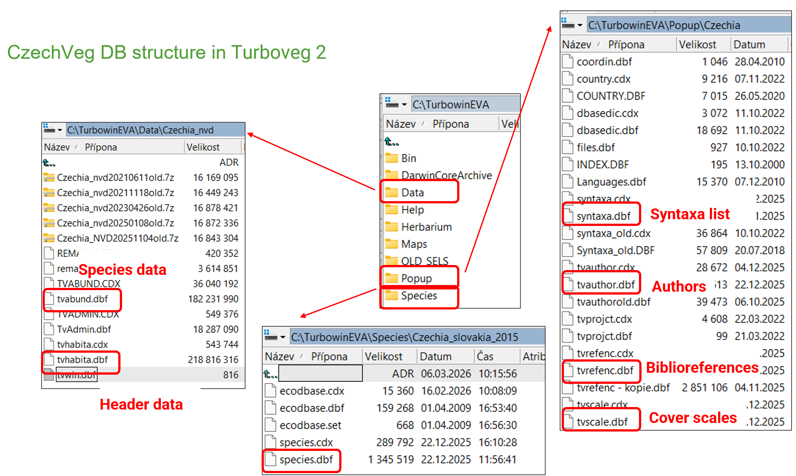
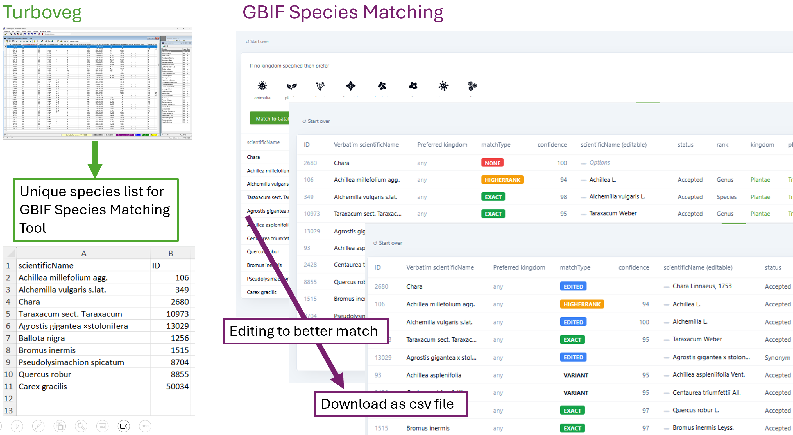
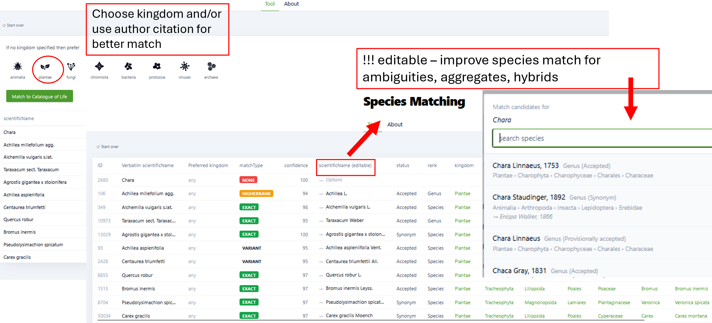
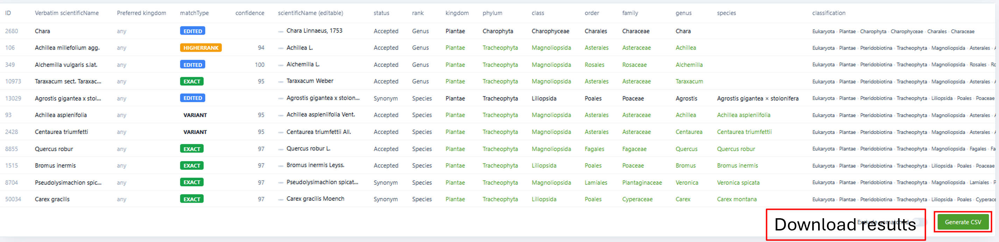

# Introduction

This tutorial describes how to export vegetation plots from the Czech Vegetation Database to GBIF as a [sampling event dataset](https://www.gbif.org/sampling-event-data).

The main inputs are the original .dbf files as generated by the [Turboveg2 program](https://czechveg.github.io/Data/turboveg.html), in which the database is stored. The output will consist of three .txt files – events, occurrences and references – containing data in a form ready for mapping to the GBIF Sampling Event Core through the Integrated Publishing Toolkit (IPT; <https://www.gbif.org/ipt>).

Because each vegetation database has its own specifics, this tutorial is not intended to serve as a universal, step-by-step manual. It rather provides an example workflow that can be adapted to the specific characteristics of different databases.

You can [download](https://github.com/CzechVeg/CzechVeg.github.io/tree/main/DataProcessingTutorial/data/CzechVeg_GBIF_training_data.zip) the training data, which contains 1000 vegetation plots from the CzechVeg DB, together with the R script and other files. You can then modify the script as needed and practise the procedure described below.

```{r}
#| label: Load packages
#| eval: false
## Required packages
library (dplyr)
library (readxl)
library (sf)
library (stringr)
library (tidyr)
```

# Input files

From Turboveg2\*:\
\
-   **tvabund** (dbf) = species data\
-   **tvhabita** (dbf) = header data\
\
-   **species** (dbf) = Turboveg2 species list\
-   **SYNTAXA** (dbf) = list of syntaxa\
-   **tvauthor** (dbf) = list of authors\
-   **tvrefenc** (dbf) = list of bibliographic references\
-   **TVSCALE** (dbf) = cover scales\
\
-   **tv.shp**\*\* (shp) = shapefile containing point locations of the input data



External files:

-   **spec.converter** (xlsx) = list of species scientific names from the input data, supplemented with scientific name authorships and other taxonomic classification variables; as obtained after preprocessing taxonomic nomenclature using the [Species Matching Tool](https://www.gbif.org/tools/species-lookup) provided by GBIF\
-   **EUNIS** (csv) = file containing classification of the input vegetation plots to EUNIS habitat units; as obtained from Turboveg3 (description of EUNIS expert classification <https://zenodo.org/records/16895007>)\
-   **eunis.names** (xlsx) = list of codes and names of EUNIS habitats\
\
*\*The objects above, which we directly export from Turboveg2, can be uploaded from external files as well in any format. For example, if you have an external file containing literature references corresponding with your Turboveg2 database, prepare a tvreferenc.xlsx with columns REFERENCE (id), AUTHOR, YEAR (of publishing), TITLE, PUBLISHED (publication).\
\*\*In the Czech Vegetation Database, coordinates are stored in DDMMSS.SS format. For example, the coordinates 49°10′41.960″N, 16°34′10.738″E are stored as 491041.96 and 163410.74, respectively. Therefore, we use the coordinates from a shapefile exported from Turboveg 2. Alternatively, the coordinates can be [converted to decimal degrees](https://czechveg.github.io/DataProcessingTutorial/turboveg_r.html#coordinates) in R. For databases in which coordinates are stored in decimal-degree format, the values in the Longitude and Latitude fields can be used directly.*

# Preprocessing of taxonomic nomenclature

To ensure that the taxonomic nomenclature in our data matches that used by GBIF as closely as possible, we followed the steps below to preprocess the taxonomic names and prepare the external file that is later uploaded as **spec.converter**.

1.  *Preparing a list of unique names*\
    We extract all unique species names from our data and prepare a file containing the following fields: scientificName (with or without the author citation); kingdom (optional); and ID (optional). The author citation, if used, must be included in the same field as the taxon name. The resulting file, corresponding with the training database, is named **GBIF_testdata_uniqueSL_forMatchingTool.csv** (folder: GBIF\\species_matching). We used the [Czech species list](https://czechveg.github.io/Data/turboveg.html#installation-and-update-of-the-czech-species-list) from Turboveg 2 and further [standardized](https://czechveg.github.io/DataProcessingTutorial/turboveg_r.html#nomenclature) the nomenclature according to the latest edition of *The Key to the Flora of the Czech Republic (Kaplan et al. \[eds.\] 2019)*. This nomenclature is used as the scientificName field in Step 2.
2.  *Matching names using the GBIF Species Matching Tool*\
    The list of unique species names can be uploaded to the [Species Matching Tool](https://www.gbif.org/tools/species-lookup), which attempts to normalize each name in the file. For larger files, species matching can also be performed through the GBIF API. In June 2026, GBIF started to use the [Catalogue of Life Extended Release](https://data-blog.gbif.org/post/catalogue-of-life-taxonomic-backbone/) (COL) as its official taxonomic backbone.
3.  *Reviewing taxonomic issues and flags*\
    After the species list has been uploaded and matched against COL, the initial results may contain various taxonomic issues and flags (described [here](https://techdocs.gbif.org/en/data-use/occurrence-issues-and-flags#taxonomic-issues)). The automatically generated matches can be reviewed and edited. Each uncertain or incorrectly matched name should be checked and normalized manually where necessary. You can experiment with shorter taxon lists (**GBIF_testspecies_forMatchingTool.csv** and **GBIF_testspecies_authorship_forMatchingTool.csv** available in the training data) by uploading them to the matching tool and editing the matched scientific names where appropriate. See what happens if you specify the preferred kingdom during data upload and when it is left unspecified.



4.  *Handling species groups and hybrids*\
    The GBIF taxonomic backbone is not able to match correctly certain types of names, such as species aggregates (agg.), broad species concepts (s. lat.), or some hybrids. In such cases, the names may (and should) be matched only to the species or genus level. Matching may be more successful when the name is present in COL.

5.  *Linking the matching results to the original data*\
    The matching results are linked back to the original species list. For the occurrence data, the relevant fields are then selected and renamed according to the Darwin Core terms (see the procedure below). The complete set of columns for the training 1000 vegetation plots, including some additional fields we added, is retained in **GBIF_testdata_uniqueSL_clean.xlsx** (to be uploaded as spec.converter below). The raw outputs from the testspecies matching and editing within the tool (GBIF_testspecies_MatchedEdited.csv and GBIF_testspecies_authorship_MatchedEdited.csv) are included in the training data.

    It is worth including the other taxonomic ranks and also the scientific name authorship obtained from the matching tool, in our species data. This ensures that our data are correctly matched to GBIF nomenclature. The verbatimIdentification field contains the original names used in our data (including for example agg.).





# Read input files to R

After downloading the training data and running the R project, all files to be read to R, except the shapefile, are prepared in the GBIF\\input_files folder within the R working directory. If a shapefile is used, its component files (including at least the .dbf, .prj, .shp, and .shx files) are stored in the GBIF\\input_files\\shp subfolder.

```{r}
#| label: Read files
#| eval: false
## Read DBF files into a list
dbf_files <- list.files(path = paste0(getwd(),"/GBIF/input_files"), pattern = "\\.dbf$", full.names = T, ignore.case = T)
dbf_list <- lapply(dbf_files, function(f) {
  st_read(f, quiet = T) %>% as.data.frame()
})
# st_read does not read any rows that you might have previously deleted from your dbf files in Turboveg2. The information about unread rows is given, e.g. “Re-reading with feature count reset from 1133 to 1131”

names (dbf_list) <- gsub("\\.dbf$", "", basename(dbf_files), ignore.case = T)

## Convert local encoding to UTF-8
dbf_list <- lapply(dbf_list, function(df) {
  char_cols <- sapply(df, is.character)
  df[char_cols] <- lapply(df[char_cols], function(col) iconv(col, from ="cp852", to ="UTF-8"))
  return(df)
})

## Read other files
spec.converter <- read_excel (paste0(getwd(),"/GBIF/input_files/GBIF_nomenclature_CZ_20260621IKuprMV.xlsx")) %>% as.data.frame()

shp_dir <- file.path(getwd(), "GBIF/input_files", "shp")
shp_file <- list.files(shp_dir, pattern = "\\.shp$", full.names = T)
tv.shp <- st_read(shp_file)

EUNIS <- read.delim (paste0(getwd(),"/GBIF/input_files/CzechVeg_TV3_EUNIS_20260810.csv"), sep = '\t')
eunis.names <- read_excel (paste0(getwd(),"/GBIF/input_files/EUNIS-habitats-codes-and-names-2025-09.xlsx")) %>% as.data.frame()
```

# Translating header and species data to the GBIF format

## Events

Column names for the *event_gbif* object to which header data will be transferred:

```{r}
#| label: Events intro
#| eval: false
event.gbif_colnames <- c(
  "eventID","countryCode","footprintWKT","geodeticDatum","decimalLongitude","decimalLatitude","coordinateUncertaintyInMeters","eventDate","samplingProtocol","sampleSizeValue","sampleSizeUnit","syntaxonName","maximumElevationInMeters","aspect","inclinationInDegrees","coverTotalInPercentage","coverTreesInPercentage","coverShrubsInPercentage","coverHerbsInPercentage","coverMossesInPercentage","coverLichensInPercentage","coverAlgaeInPercentage","coverLitterInPercentage","coverWaterInPercentage","coverRockInPercentage","mossesIdentified","lichensIdentified","treeLayerHeightInMeters","shrubLayerHeightInMeters","herbLayerHeightInCentimeters","verbatimLocality","habitat","RELEVE_NR"
)

event.gbif_nrow <- nrow(dbf_list$tvhabita)
event.gbif_ncol <- length(event.gbif_colnames)

event_gbif <- as.data.frame(matrix(nrow = event.gbif_nrow, ncol = event.gbif_ncol))
colnames(event_gbif) <- event.gbif_colnames
```

[Event ID](https://www.gbif.org/cs/data-quality-requirements-sampling-events#dcEventID) should be a unique identifier for each sampling event. We therefore constructed it by combining the Global Index of Vegetation Databases ID of CzechVeg DB (EU-CZ-001) with Turboveg relevé numbers (which is the persistent identifier used in the CzechVeg DB).

```{r}
#| label: Event ID
#| eval: false
event_gbif$eventID <- paste0("EU-CZ-001-", dbf_list$tvhabita$RELEVE_NR)
event_gbif$RELEVE_NR <- dbf_list$tvhabita$RELEVE_NR # original relevé number (= vegetation plot identifier) which will be useful here in next steps
```

Now, individual columns of *event_gbif* will be filled to match the GBIF format requirments:

```{r}
#| label: Events properties
#| eval: false
## Coordinates
event_gbif$countryCode <- dbf_list$tvhabita$COUNTRY

coords <- st_coordinates(tv.shp)
event_gbif$footprintWKT <- paste0("POINT (", coords[,1]," ", coords[,2], ")")

event_gbif[,c("decimalLongitude","decimalLatitude")] <- coords[,1:2]
event_gbif$geodeticDatum <- "EPSG:4326"

# Replace NAs or other values representing NAs, such as 0 in this case, with empty strings ("") for GBIF
event_gbif <- event_gbif %>% mutate(
  coordinateUncertaintyInMeters = if_else(
      dbf_list$tvhabita$PRECISION == 0, "", as.character(dbf_list$tvhabita$PRECISION)
    )
  )

## Date
dates_char <- dbf_list$tvhabita$DATE
date_obj <- rep(as.Date(NA), length(dates_char))

# Turboveg2 formats (YYYYMMDD, YYYYMM, YYYY) are translated to standard formats (YYYY-MM-DD, YYYY-MM, YYYY)
idx_7_8 <- which(nchar(dates_char) %in% c(7, 8))
idx_6 <- which(nchar(dates_char) == 6)
idx_4 <- which(nchar(dates_char) == 4) 
date_obj[idx_7_8] <- as.Date(dates_char[idx_7_8], format = "%Y%m%d")
date_obj[idx_6] <- as.Date(paste0(dates_char[idx_6], "01"), format = "%Y%m%d")  
date_obj[idx_4] <- as.Date(paste0(dates_char[idx_4], "0101"), format = "%Y%m%d")

date_out <- character(length(dates_char))
date_out[idx_7_8] <- format(date_obj[idx_7_8], "%Y-%m-%d")
date_out[idx_6] <- format(date_obj[idx_6], "%Y-%m")
date_out[idx_4] <- format(date_obj[idx_4], "%Y")

date_out [is.na(date_out)] <- ""
event_gbif$eventDate <- date_out

## Cover scale
coverScale_df <- data.frame (SCALE_NR = dbf_list$tvhabita$COVERSCALE)
coverScale_df <- left_join (coverScale_df, dbf_list$TVSCALE [,c("SCALE_NR","SCALE_NAME")], by = "SCALE_NR") 

coverScale_df$SCALE_NAME <- sub("Braun/Blanquet", "Braun-Blanquet", coverScale_df$SCALE_NAME, fixed = T)
coverScale_df$SCALE_NAME <- sub("Percentual scale", "Percentual", coverScale_df$SCALE_NAME, fixed = T)

event_gbif$samplingProtocol <- paste0("vegetation plot with ", coverScale_df$SCALE_NAME, " scale for cover") # GBIF verbal description of sampling protocol
event_gbif$samplingProtocol2 <- coverScale_df$SCALE_NAME # for later use

## Plot size
event_gbif$sampleSizeValue <- as.character(dbf_list$tvhabita$SURF_AREA)
event_gbif$sampleSizeValue [event_gbif$sampleSizeValue %in% c("-1","0")] <- ""
event_gbif$sampleSizeUnit <- "square metre"

## Syntaxon based on the Czech Expert System
dbf_list$tvhabita <- dbf_list$tvhabita %>%
  mutate(code_name = ifelse(!is.na(ESY_CODE) & !is.na(ESY_NAME), paste(ESY_CODE, ESY_NAME, sep = " - "), NA))
event_gbif$syntaxonName <- dbf_list$tvhabita$code_name
event_gbif$syntaxonName[is.na(event_gbif$syntaxonName)] <- ""

## Topography
dbf_list$tvhabita <- dbf_list$tvhabita %>%
  mutate(
    across(
      c(ALTITUDE, EXPOSITION, INCLINATIO),
      ~ replace(as.character(.x), is.na(.x) | .x == "-1", "")
    )
  )

event_gbif$maximumElevationInMeters <- dbf_list$tvhabita$ALTITUDE

event_gbif$aspect <- dbf_list$tvhabita$EXPOSITION
event_gbif$inclinationInDegrees <- dbf_list$tvhabita$INCLINATIO

## Cover species groups
dbf_list$tvhabita$COV_TOTAL[dbf_list$tvhabita$COV_TOTAL %in% c("-1","0")] <- ""
event_gbif$coverTotalInPercentage <- dbf_list$tvhabita$COV_TOTAL

dbf_list$tvhabita <- dbf_list$tvhabita %>%
  mutate(across(
    COV_TREES:COV_ROCK,
    ~ replace(as.character(.x), .x == -1 | .x == "-1", "")
  ))

event_gbif$coverTreesInPercentage <- dbf_list$tvhabita$COV_TREES
event_gbif$coverShrubsInPercentage <- dbf_list$tvhabita$COV_SHRUBS
event_gbif$coverHerbsInPercentage <- dbf_list$tvhabita$COV_HERBS
event_gbif$coverMossesInPercentage <- dbf_list$tvhabita$COV_MOSSES
event_gbif$coverLichensInPercentage <- dbf_list$tvhabita$COV_LICHEN
event_gbif$coverAlgaeInPercentage <- dbf_list$tvhabita$COV_ALGAE
event_gbif$coverLitterInPercentage <- dbf_list$tvhabita$COV_LITTER
event_gbif$coverWaterInPercentage <- dbf_list$tvhabita$COV_WATER
event_gbif$coverRockInPercentage <- dbf_list$tvhabita$COV_ROCK

dbf_list$tvhabita$MOSS_IDENT <- ifelse(dbf_list$tvhabita$MOSS_IDENT == "Y", "1", 
                                       ifelse(dbf_list$tvhabita$MOSS_IDENT == "N", "0", ""))
dbf_list$tvhabita$MOSS_IDENT [is.na(dbf_list$tvhabita$MOSS_IDENT)] <- ""
event_gbif$mossesIdentified <- dbf_list$tvhabita$MOSS_IDENT

dbf_list$tvhabita$LICH_IDENT <- ifelse(dbf_list$tvhabita$LICH_IDENT == "Y", "1", 
                                       ifelse(dbf_list$tvhabita$LICH_IDENT == "N", "0", ""))
dbf_list$tvhabita$LICH_IDENT [is.na(dbf_list$tvhabita$LICH_IDENT)] <- ""
event_gbif$lichensIdentified <- dbf_list$tvhabita$LICH_IDENT

## Vegetation layers height
dbf_list$tvhabita <- dbf_list$tvhabita %>%
  mutate(across(
    c(TREE_HIGH, SHRUB_HIGH, HERB_HIGH),
    ~ replace(as.character(.x), is.na(.x) | .x == -1 | .x == "-1", "")
  ))

event_gbif$treeLayerHeightInMeters <- dbf_list$tvhabita$TREE_HIGH
event_gbif$shrubLayerHeightInMeters <- dbf_list$tvhabita$SHRUB_HIGH
event_gbif$herbLayerHeightInCentimeters <- dbf_list$tvhabita$HERB_HIGH

## Locality
event_gbif$verbatimLocality <- "" # to be fixed soon

## EUNIS habitat type
EUNIS$Expert.classification[EUNIS$Expert.classification %in% c("~","")] <- NA

comma.delim <- unique(EUNIS$Expert.classification) %>% .[!is.na(.) & str_detect(., ",")]
EUNIS$Expert.classification[EUNIS$Expert.classification %in% comma.delim] <- NA

colnames(eunis.names) <- c("Expert.classification","eunis.name")
EUNIS <- left_join(EUNIS, eunis.names, by = "Expert.classification")

EUNIS <- EUNIS %>%
  mutate(code_name = ifelse(!is.na(Expert.classification) & !is.na(eunis.name), paste(Expert.classification, eunis.name, sep = " - "), ""))

event_gbif <- left_join(event_gbif, EUNIS[,c("TV2.relevé.number","code_name")],by = c("RELEVE_NR" = "TV2.relevé.number"))
event_gbif$habitat <- event_gbif$code_name
event_gbif$code_name <- NULL
```

## References

```{r}
#| label: References
#| eval: false
## Bibliographic references just for vegetation plots where they are indicated in the database
tvreferenc <- dbf_list$tvrefenc[,c("REFERENCE","AUTHOR","YEAR","TITLE","PUBLISHED")] %>% unique()

reference.yes <- dbf_list$tvhabita [!is.na(dbf_list$tvhabita$REFERENCE),]
reference.yes <- left_join (reference.yes, event_gbif [c("RELEVE_NR","eventID")], by = "RELEVE_NR")
reference.yes <- reference.yes [,c("REFERENCE","eventID")]

references_gbif <- left_join (reference.yes, tvreferenc, by = "REFERENCE")
colnames(references_gbif)[3:6] <- c("creator",	"date",	"title",	"source")
references_gbif$REFERENCE <- NULL
```

## Occurrences

```{r}
#| label: Occurrences
#| eval: false
occur.gbif_colnames <- c(
  "eventID","occurrenceID","basisOfRecord","originalNameUsageID","verbatimIdentification","scientificName","scientificNameAuthorship","acceptedNameUsage","status","verbatimTaxonRank","rank","kingdom","phylum","class","order","family","genus","species","infragenericEpithet","infraspecificEpithet","vegetationLayer","organismQuantity","organismQuantityType","dynamicProperties","recordedBy","recordedByID","SPECIES_NR","RELEVE_NR"
)

occur.gbif_nrow <- nrow(dbf_list$tvabund)
occur.gbif_ncol <- length(occur.gbif_colnames)

occur_gbif <- as.data.frame(matrix(nrow = occur.gbif_nrow, ncol = occur.gbif_ncol))
colnames(occur_gbif) <- occur.gbif_colnames

tvabund_df <- data.frame (dbf_list$tvabund)
tvabund_df <- left_join (tvabund_df, event_gbif[,c("RELEVE_NR","eventID")], by = "RELEVE_NR")

occur_gbif$SPECIES_NR <- tvabund_df$SPECIES_NR
occur_gbif$RELEVE_NR <- tvabund_df$RELEVE_NR

## occurrence ID = eventID + speciesID + layerID
occur_gbif$eventID <- tvabund_df$eventID
occur_gbif$occurrenceID <- paste(tvabund_df$eventID, tvabund_df$SPECIES_NR, tvabund_df$LAYER, sep = "/")
occur_gbif$basisOfRecord <- "HumanObservation"

tvabund_df <- left_join(tvabund_df, spec.converter[,c("SPECIES_NR","verbatimIdentification","scientificName","scientificNameAuthorship","acceptedNameUsage","rank","status","RankGbif","kingdom","phylum","class","order","family","genus","species","infragenericEpithet","infraspecificEpithet")], by = "SPECIES_NR")

tvabund_df <- tvabund_df %>% mutate(across(c(verbatimIdentification,scientificName,scientificNameAuthorship,acceptedNameUsage,status,rank,kingdom,phylum,class,order,family,genus,species,infragenericEpithet,infraspecificEpithet),~ .x %>% as.character() 
                                           %>% na_if("NA") 
                                           %>% replace_na("")))

occur_gbif$originalNameUsageID <- occur_gbif$SPECIES_NR

occur_gbif$verbatimIdentification <- tvabund_df$verbatimIdentification 
occur_gbif$scientificName <- tvabund_df$scientificName
occur_gbif$scientificNameAuthorship <- tvabund_df$scientificNameAuthorship
occur_gbif$acceptedNameUsage <- tvabund_df$acceptedNameUsage

occur_gbif$status <- tvabund_df$status
occur_gbif$verbatimTaxonRank <- tvabund_df$rank
occur_gbif$rank <- tvabund_df$RankGbif
occur_gbif$kingdom <- tvabund_df$kingdom
occur_gbif$phylum <- tvabund_df$phylum
occur_gbif$class <- tvabund_df$class
occur_gbif$order <- tvabund_df$order
occur_gbif$family <- tvabund_df$family
occur_gbif$genus <- tvabund_df$genus
occur_gbif$species <- tvabund_df$species
occur_gbif$infragenericEpithet <- tvabund_df$infragenericEpithet
occur_gbif$infraspecificEpithet <- tvabund_df$infraspecificEpithet

## Vegetation layers
vegetationLayer_df <- data.frame (LAYER = sort(unique (dbf_list$tvabund$LAYER)),
                                  vegetationLayer = c("","tree","tree","tree","shrub","shrub","herbaceous","juvenile","seedling","cryptogam"))

tvabund_df <- left_join(tvabund_df,vegetationLayer_df,by = "LAYER")
occur_gbif$vegetationLayer <- tvabund_df$vegetationLayer

## Translate original scale values to percentage
tvabund_df <- left_join(tvabund_df,event_gbif[,c("RELEVE_NR","samplingProtocol2")],by = "RELEVE_NR")

TVSCALE_df <- dbf_list$TVSCALE
TVSCALE_df$SCALE_NAME <- sub("Braun/Blanquet", "Braun-Blanquet", TVSCALE_df$SCALE_NAME, fixed = T)
TVSCALE_df$SCALE_NAME <- sub("Percentual scale", "Percentual", TVSCALE_df$SCALE_NAME, fixed = T)

TVSCALE_df_long <- TVSCALE_df[,c(2,4,5)]
colnames(TVSCALE_df_long)[2:3] <- c("orig","perc")

for (i in seq(4, ncol(TVSCALE_df) - 2, by = 2)) 
  {
  to.rbind <- TVSCALE_df[, c(2, i + 2, i + 3)]
  colnames(to.rbind)[2:3] <- c("orig","perc")
  TVSCALE_df_long <- rbind(TVSCALE_df_long, to.rbind)
  }
TVSCALE_df_long <- TVSCALE_df_long[complete.cases(TVSCALE_df_long),]

TVSCALE_df_long$SCALE_NAME_value_orig <- paste(TVSCALE_df_long$SCALE_NAME, TVSCALE_df_long$orig, sep = "_")
TVSCALE_df_long <- unique(TVSCALE_df_long)
TVSCALE_df_long$perc [TVSCALE_df_long$SCALE_NAME %in% "Presence/Absence"] <- NA

tvabund_df$SCALE_NAME_value_orig <- paste(tvabund_df$samplingProtocol2, tvabund_df$COVER_CODE, sep = "_")

tvabund_df <- left_join(tvabund_df, TVSCALE_df_long [,c("SCALE_NAME_value_orig", "perc")], by = "SCALE_NAME_value_orig")
perc.values.default <- which (tvabund_df$samplingProtocol %in% "Percentage (%)" & !(tvabund_df$SCALE_NAME_value_orig %in% c("Percentage (%)_9x","Percentage (%)_9X")))

tvabund_df$perc [perc.values.default] <- as.numeric(tvabund_df$COVER_CODE [perc.values.default])
tvabund_df$perc[is.na(tvabund_df$perc)] <- ""

occur_gbif$organismQuantity <- tvabund_df$perc
occur_gbif$organismQuantityType [which (occur_gbif$organismQuantity %in% "")] <- "presence only"
occur_gbif$organismQuantityType [which (!(occur_gbif$organismQuantity %in% ""))] <- "percentageCoverage"

## DynamicProperties ~ original scale value
tvabund_df$dynamicProperties <- paste0("{'coverScale':'",tvabund_df$samplingProtocol2,"'",",'coverScaleCode':'",tvabund_df$COVER_CODE,"'",",'VegetationLayer':'",tvabund_df$vegetationLayer,"'}")
occur_gbif$dynamicProperties <- tvabund_df$dynamicProperties

## Author of the record
author_df <- dbf_list$tvhabita [,c("RELEVE_NR","AUTHOR")]
author_df$AUTHOR <- as.numeric(author_df$AUTHOR)
dbf_list$tvauthor$AUTH_CODE <- as.numeric(dbf_list$tvauthor$AUTH_CODE)

author_df <- left_join(author_df, dbf_list$tvauthor, by = c("AUTHOR" = "AUTH_CODE"))
tvabund_df <- left_join(tvabund_df, author_df, by = "RELEVE_NR")

## Rearranging names

# Some names need to be rearranged to match the GBIF format requirements
tvabund_df <- tvabund_df %>% mutate(n_words = str_count(AUTH_NAME, "\\S+"),
    has_extra_parts = n_words > 2)

tvabund_df$pre_names_order <- 1:nrow(tvabund_df)

AUTH_NAME_special <- data.frame(AUTH_NAME = unique (tvabund_df$AUTH_NAME [tvabund_df$has_extra_parts == T]))
AUTH_NAME_special$has_eq <- grepl("=", AUTH_NAME_special$AUTH_NAME)
AUTH_NAME_special$name_corrected <- NA

x <- c(AUTH_NAME_special$AUTH_NAME[AUTH_NAME_special$has_eq])

parts  <- strsplit(x, " = ")
left   <- sapply(parts, `[`, 1) # left surname
right  <- sapply(parts, `[`, 2)
fname  <- sapply(strsplit(right, " "), `[`, 2) # first name on the right

result <- paste(fname, left)
result[result %in% " Halúzová"] <- "Jana Halúzová"
result[result %in% "Jana Tkačíková"] <- "Jana Tkáčiková"

AUTH_NAME_special$name_corrected[AUTH_NAME_special$has_eq] <- result

x <- c(AUTH_NAME_special$AUTH_NAME[!AUTH_NAME_special$has_eq])

parts  <- strsplit(x, " ")
left   <- sapply(parts, `[`, 1) # left surname
middle  <- sapply(parts, `[`, 2)
right  <- sapply(parts, `[`, 3)

result <- paste(middle, right, left)
result[result %in% "NA NA NA"] <- NA
result[result %in% "Lubomír - Tichý"] <- "Lubomír Tichý"
result[result %in% "Kabátová Klára Nunvářová"] <- "Klára Kabátová Nunvářová"

AUTH_NAME_special$name_corrected[!AUTH_NAME_special$has_eq] <- result

tvabund_df_special_names <- tvabund_df [which (tvabund_df$AUTH_NAME %in% AUTH_NAME_special$AUTH_NAME),]
tvabund_df <- tvabund_df [-which (tvabund_df$AUTH_NAME %in% AUTH_NAME_special$AUTH_NAME),]

tvabund_df_special_names <- left_join(tvabund_df_special_names, AUTH_NAME_special[,c("AUTH_NAME","name_corrected")], by = "AUTH_NAME")

parts  <- strsplit(tvabund_df$AUTH_NAME, " ") 
left   <- sapply(parts, `[`, 1)
right  <- sapply(parts, `[`, 2)

result <- paste(right, left)
tvabund_df$name_corrected <- result

tvabund_df$name_corrected [grepl("Neuhäuslová", tvabund_df$AUTH_NAME, fixed = T)] <- "Zdenka Neuhäuslová"
tvabund_df$name_corrected [grepl("Anonym", tvabund_df$AUTH_NAME, fixed = T)] <- "anonymous"

tvabund_df <- rbind(tvabund_df,tvabund_df_special_names)
tvabund_df <- tvabund_df[order(tvabund_df$pre_names_order),]

occur_gbif$recordedBy <- tvabund_df$name_corrected
occur_gbif$recordedByID <- tvabund_df$AUTHOR

## Delete auxiliary columns
occur_gbif[,c("SPECIES_NR","RELEVE_NR")] <- NULL
event_gbif[,c("RELEVE_NR","samplingProtocol2")] <- NULL
```

# Export files for GBIF

The vegetation database stored within .txt files that are exported below is ready for publishing on GBIF through the IPT.

```{r}
#| label: Export GBIF
#| eval: false
write.table(event_gbif, "event_tutor_gbif_2026-08-31.txt", sep = '\t', row.names = F, fileEncoding = "UTF-8")

write.table(references_gbif, "references_tutor_gbif_2026-08-31.txt", sep = '\t', row.names = F, fileEncoding = "UTF-8")

write.table(occur_gbif, "occurrences_tutor_gbif_2026-08-31.txt", sep = '\t', row.names = F, fileEncoding = "UTF-8")
```
